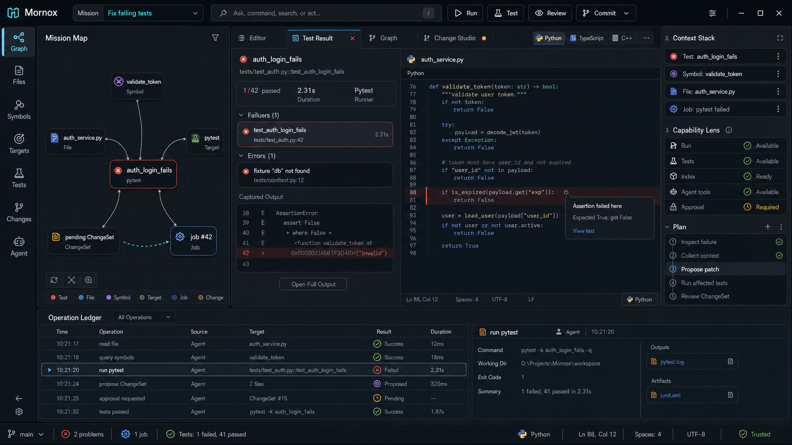

# Mission Workbench UI



Mornox should present itself as a mission-first workbench, not as a traditional
file-first IDE with an AI chat panel attached. The UI should make the structured
capabilities of Mornox Core visible as native workflow objects: missions,
context, project graph nodes, capabilities, plans, operations, and change sets.

## Product Position

Mornox is a mission-first polyglot agent workbench. A user starts from a goal,
then Mornox helps gather context, expose relevant capabilities, execute
auditable operations, and review changes.

The primary workflow is:

```text
Mission -> Context -> Capabilities -> Plan -> Operation -> Review
```

Files and editors remain important, but they are one surface inside a broader
task model. Build results, test failures, search results, graph views, debug
sessions, agent proposals, and change reviews should all appear as first-class
task surfaces.

## Core Layout

The workbench is organized into five persistent regions:

```text
Mission Bar
Workspace Rail + Mission Map | Task Surface | Inspector
Operation Ledger
Status Bar
```

The layout should keep the central task surface as the main focus while making
the current mission context and operation history easy to inspect.

## Mission Bar

The Mission Bar replaces a traditional toolbar, global search box, and agent
chat input.

It should show:

- Current mission, such as `Fix failing tests`.
- Intent input for commands, search, navigation, and agent actions.
- Compact actions for running, testing, reviewing, approving, and committing.

The Mission Bar should not behave like a generic chat box. User input should be
interpreted against the current mission and context stack.

## Workspace Rail

The left rail provides stable workspace perspectives:

- Graph
- Files
- Symbols
- Targets
- Tests
- Changes
- Agent
- Plugins

The file tree is only one perspective. The default mission-first view should
prefer `Graph` when a mission has active context.

## Mission Map

`Graph` is the current mission map. It is not a decorative full-project
architecture diagram, and it should not replace the editor.

It answers:

```text
Which workspace objects are involved in the current mission, and how are they
related?
```

Example mission map:

```text
auth_login_fails
  -> validate_token
  -> auth_service.py
  -> pytest
  -> pending ChangeSet
  -> job #42
```

Mission map nodes can include:

- Files
- Symbols
- Diagnostics
- Tests
- Build targets
- Run configurations
- Jobs
- Change sets
- Agent operations
- Plugin capabilities
- Git diffs

The left panel should show a compact graph preview. A full `Graph` task surface
can open in the center when the user needs to inspect the relationship graph in
detail.

## Task Surface

The central area is a task surface stack, not just editor tabs.

Surface types include:

- Source editor
- Test result
- Build result
- Search result
- Project graph
- Change Studio
- Agent proposal
- Refactor preview
- Debug session
- Plugin output
- Scratch file

The active surface should follow the mission. A failing test mission may open a
test result surface. A proposed edit should open Change Studio. A normal coding
task can remain in the editor.

## Inspector

The right panel explains the current task surface through structured state
instead of chat history.

### Context Stack

The Context Stack contains the explicit evidence used by the current mission.

Typical items include:

- Current file
- Current symbol
- Diagnostic
- Failing test
- Job
- Change set
- Git diff
- Agent-collected context
- Approval requirement

Any relevant object in the UI should be addable to the context stack. Commands
such as `fix this` should resolve `this` through explicit context, not through
implicit chat history.

### Capability Lens

The Capability Lens shows what Mornox can do for the current context.

Capabilities may come from:

- `CapabilityRegistry`
- `LanguageRegistry`
- `ProjectModel`
- `BuildService`
- `RunConfigurationService`
- `DebugService`
- `RefactoringService`
- `AgentToolRegistry`
- Active plugins

Examples:

- Run available
- Tests available
- Debug available
- Rename supported
- Semantic index ready
- Agent tools available
- Approval required
- Workspace trust restricted

This keeps the UI provider-driven and language-neutral.

### Plan Rail

The Plan Rail shows the current mission's structured execution plan.

Example steps:

- Inspect failure
- Collect context
- Propose patch
- Run affected tests
- Review ChangeSet

Plan steps should be inspectable, cancellable where possible, and linked to the
operations and task surfaces they produce.

## Operation Ledger

The bottom panel is an auditable operation ledger, not a traditional output
dump.

It records important operations such as:

- Read file
- Query symbols
- Run build
- Run tests
- Activate plugin
- Request approval
- Propose ChangeSet
- Apply ChangeSet
- Commit
- Push

Each ledger entry should link to its inputs, outputs, related graph nodes, and
result surfaces. This is essential for agent-native workflows because the user
must be able to understand what the system and agents did.

## Change Studio

Change Studio is the review surface for agent edits, refactorings, and other
structured workspace edits.

It should support:

- Mission-grouped changes
- File, hunk, and semantic operation review
- Accept and reject operations
- Related tests and diagnostics
- Approval state
- Apply and undo through `ChangeSetService`
- Commit summary generation

Agent edits should enter Change Studio as change sets rather than silently
mutating the user's workspace.

## Visual Direction

The default theme should be dark and restrained:

- Neutral graphite base.
- Near-black central task surface.
- Slightly raised charcoal panels.
- Low-contrast dividers.
- Cyan or teal for the active mission and focused selection.
- Amber for warnings and approvals.
- Red only for errors.

The UI should feel like a premium engineering workbench. It should avoid a
marketing-page look, a dashboard-card layout, an AI-chat product layout, or a
clone of existing IDEs.

## MVP Scope

The first Qt UI should implement the structure before the full intelligence.

Initial scope:

- Qt6 Widgets shell and dark theme.
- Mission Bar with command input and compact actions.
- Workspace Rail with Graph, Files, Changes, and Agent entries.
- Mission Map preview driven by current file, diagnostics, jobs, and change
  sets.
- Task Surface with editor tabs and basic result surfaces.
- Inspector with Context Stack, Capability Lens, and Plan Rail placeholders
  backed by available core state.
- Operation Ledger backed by jobs, agent operations, plugin events, approvals,
  and change sets where available.
- Status Bar showing branch, problems, jobs, language, cursor position, and
  workspace trust.

Later phases can deepen Graph, Change Studio, Debug, Agent sessions, plugin
capability browsing, and semantic refactoring workflows.
